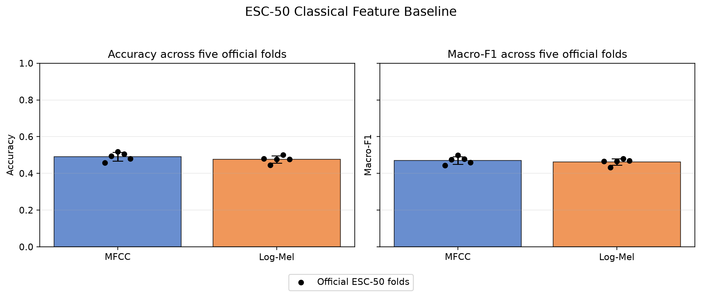
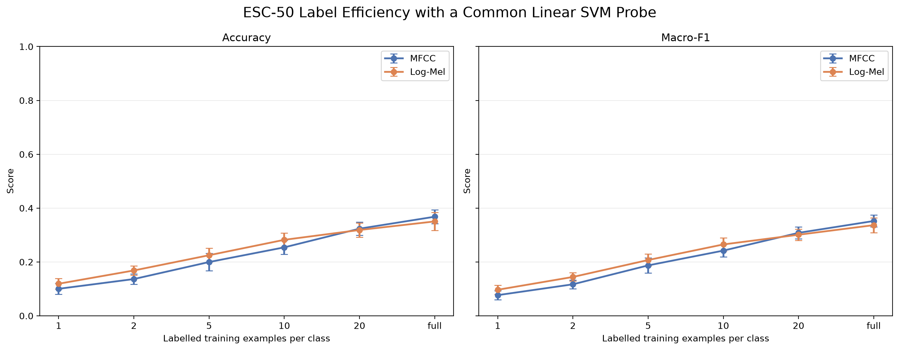

# Label-Efficient Environmental Sound Classification

**ELEC5305 Project - Haoliang Xiong (500051742)**

## Research question

How does environmental-sound classification performance scale with the number of labelled examples when using classical MFCC and Log-Mel representations versus a frozen pretrained audio-language representation?

## Project Feedback Two checkpoint

The completed checkpoint includes:

- full validation of all 2,000 ESC-50 recordings;
- five-fold leakage-safe MFCC and Log-Mel RBF-SVM baselines;
- common linear-probe experiments using 1, 2, 5, 10, 20, and all available labels per class;
- five repeated training selections at each non-full label budget;
- accuracy, macro-F1, timing, confusion matrices, and reproducible sample records.

Frozen CLAP embedding and zero-shot experiments are the next milestones. No CLAP performance result is claimed at this checkpoint.

## Preliminary full-data RBF-SVM results

| Representation | Accuracy | Macro-F1 |
|---|---:|---:|
| MFCC | 0.4910 ± 0.0232 | 0.4711 ± 0.0207 |
| Log-Mel | 0.4760 ± 0.0197 | 0.4623 ± 0.0180 |

## Classical label efficiency

Log-Mel gives higher mean accuracy and macro-F1 from 1 to 10 labelled examples per class. MFCC slightly exceeds Log-Mel at 20 examples and in the complete 32-example-per-class training condition. These findings are preliminary classical-feature results; CLAP will be added under the same controlled protocol.

## Project resources

- [Repository README and reproduction instructions](README.md)
- [Source code](src/)
- [Result tables and metadata](results/)
- [Figures](results/figures/)
- [Assignment 1 proposal](Assignment1_Project_Feedback_one/)
